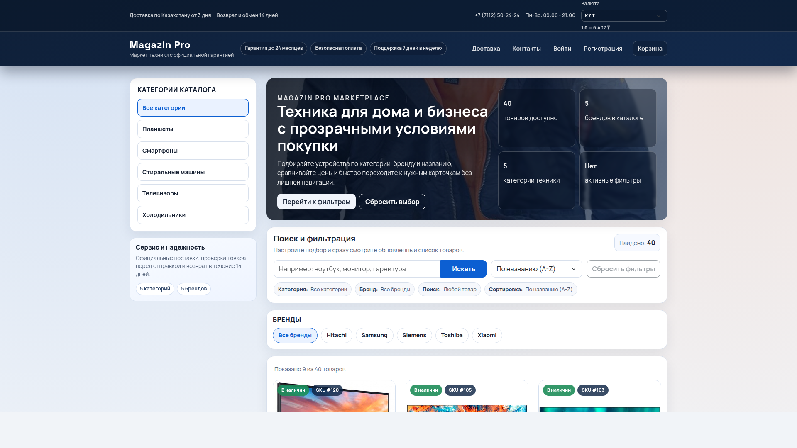

# JavaScript Shop



## Принимайте участие в разработке
Приветствуются пулл-реквесты (PR) и сообщения об ошибках. Пожалуйста, добавляйте тесты для нового функционала.

Интернет-магазин на:
- `server` - Node.js + Express + Sequelize + PostgreSQL
- `client` - React 19 + Vite (единый клиент)

## Версии backend-стека

- `Node.js`: `^20.19.0 || >=22.12.0`
- `Express`: `^5.2.1`
- `Sequelize`: `^6.37.7`
- `PostgreSQL`: `15+` (рекомендуется `16`, Docker по умолчанию: `postgres:16-alpine`)


## Требования

- Node.js `^20.19.0` или `>=22.12.0`
- npm 9+
- PostgreSQL `15+` (рекомендуется 16)
- Docker 24+ и Docker Compose v2 (опционально)

## Локальный запуск

1. Создайте базу:

```sql
CREATE DATABASE online_store;
```

2. Сервер:

```bash
cd server
cp .env.example .env
npm install
npm run start-dev
```

Минимально проверьте в `server/.env`:
- `DB_HOST`, `DB_NAME`, `DB_USER`, `DB_PASS`, `DB_PORT`
- `SECRET_KEY` (обязательно замените значение по умолчанию)
- `DB_SYNC=true` только для первичной инициализации локальной БД

Сервер: `http://localhost:7000`.

3. Клиент:

```bash
cd ../client
cp .env.example .env
npm install
npm start
```

Клиент: `http://localhost:3000`.

Если нужен заполненный каталог, импортируйте дамп:

```bash
psql -U postgres online_store < database.sql
```

Быстрое восстановление каталога (товары + характеристики) из `database.sql`:

```bash
cd server
npm run restore:catalog
```

Для Docker с дефолтными параметрами (`shop-db`):

```bash
DB_HOST=localhost DB_PORT=5432 DB_USER=postgres DB_PASS=postgres DB_NAME=online_store npm --prefix server run restore:catalog
```

## Docker

Запуск из корня:

```bash
cp .env.example .env
docker compose up -d --build
```

Docker автоматически использует:
- `server/.env.docker` для backend
- root `.env` для `POSTGRES_IMAGE` (версия Postgres)

Сервисы:
- клиент: `http://localhost:3000`
- API: `http://localhost:7000/api`
- health: `http://localhost:7000/health`

Проверка после старта:

```bash
docker compose ps
curl http://localhost:7000/health
```

Остановка:

```bash
docker compose down
```

Полный рестарт проекта с пересборкой:

```bash
docker compose down && docker compose up -d --build
```

С очисткой данных PostgreSQL:

```bash
docker compose down -v
```

## PostgreSQL 15/16 в Docker

По умолчанию используется образ `postgres:16-alpine`.

Можно переключить, например, на 15 (через `.env`):

```bash
POSTGRES_IMAGE=postgres:15-alpine
```

Или разово без изменения `.env`:

```bash
POSTGRES_IMAGE=postgres:15-alpine docker compose up -d --build
```

Если меняете major-версию PostgreSQL на уже существующем volume, обычно нужен перезапуск с очисткой данных:

```bash
docker compose down -v
docker compose up -d --build
```

## Переменные окружения

### `server/.env`

```env
PORT=7000

DB_HOST=localhost
DB_NAME=online_store
DB_USER=postgres
DB_PASS=change_me
DB_PORT=5432

SECRET_KEY=change_me
BCRYPT_SALT_ROUNDS=10
CORS_ORIGINS=http://localhost:3000
RATE_LIMIT_MAX=300
UPLOAD_MAX_FILE_SIZE=5242880
DB_SYNC=true
```

### `client/.env`

```env
VITE_API_URL=http://localhost:7000/api/
VITE_IMG_URL=http://localhost:7000/
```

## Скрипты

### `server`
- `npm run start-dev` - dev-запуск
- `npm start` - production-запуск
- `npm test` - API smoke-тесты
- `npm run seed:users` - фикстуры пользователей
- `npm run restore:catalog` - восстановление товаров и свойств из `database.sql`

### `client`
- `npm start` / `npm run dev` - запуск Vite
- `npm run build` - production-сборка
- `npm run preview` - preview сборки
- `npm test` - unit-тесты (Vitest)

## Валюта в витрине

В шапке сайта доступен переключатель валюты:
- `KZT` (по умолчанию)
- `RUB`

Курс `RUB -> KZT` синхронизируется из внешних API через backend:
- `GET /api/currency/rub-kzt` (поддерживает `?refresh=1` для принудительной актуализации)
- при недоступности внешних источников используется безопасный fallback.

## API каталога: поиск и сортировка

`GET /api/product/getall` поддерживает параметры:
- `q` - строка поиска (до 80 символов, ищет по названию товара, бренду и категории)
- `sort` - сортировка (`name_asc`, `price_asc`, `price_desc`, `rating_desc`, `newest`)
- `page` - номер страницы (по умолчанию `1`)
- `limit` - элементов на страницу (по умолчанию `3`, максимум `100`)

Параметры можно комбинировать с маршрутами фильтрации:
- `/api/product/getall/categoryId/:categoryId`
- `/api/product/getall/brandId/:brandId`
- `/api/product/getall/categoryId/:categoryId/brandId/:brandId`

## API контента: шапка, доставка, контакты, главная

- `GET /api/content/navbar` — публично, данные шапки сайта
- `PUT /api/content/navbar` — только администратор, обновляет шапку
- `GET /api/content/delivery` — публично, страница доставки и список GPS-точек
- `PUT /api/content/delivery` — только администратор, обновляет страницу доставки и точки
- `GET /api/content/contacts` — публично, данные страницы контактов
- `PUT /api/content/contacts` — только администратор, обновляет контакты
- `GET /api/content/home` — публично, hero-блок главной страницы
- `PUT /api/content/home` — только администратор, обновляет hero-блок главной
- `DELETE /api/content/home` — только администратор, удаляет/сбрасывает hero-блок главной

## API валют

- `GET /api/currency/rub-kzt` — курс RUB → KZT (`?refresh=1` для принудительного обновления)
- `GET /api/currency/overview` — обзор курсов для виджетов кабинета
  - параметры: `base` (например `KZT`), `symbols` (например `USD,EUR,RUB,KZT,CNY,GBP`), `refresh=1`

## API обратной связи

- `POST /api/feedback/create` — публично, отправка обращения из формы обратной связи
- `GET /api/feedback/admin/getall` — только администратор, список обращений (`?status=new|read|spam`)
- `GET /api/feedback/admin/getone/:id` — только администратор, чтение обращения
- `PATCH /api/feedback/admin/read/:id` — только администратор, пометить как прочитанное
- `PATCH /api/feedback/admin/block/:id` — только администратор, пометить как спам и заблокировать отправителя
- `DELETE /api/feedback/admin/delete/:id` — только администратор, удалить обращение

## Тесты и проверка

Локально:

```bash
cd server && npm test
cd ../client && npm test && npm run build
```

В Docker:

```bash
docker compose run --rm --no-deps -v "$PWD/server:/app" server sh -lc "npm ci && npm test"
docker compose run --rm --no-deps -v "$PWD/client:/workspace/client" server sh -lc "cd /workspace/client && npm ci && npm test && npm run build"
```

## Фикстуры пользователей

По умолчанию:
- admin: `admin@local.test` / `Admin12345`
- user: `user@local.test` / `User12345`

Локально:

```bash
cd server
npm run seed:users
```
